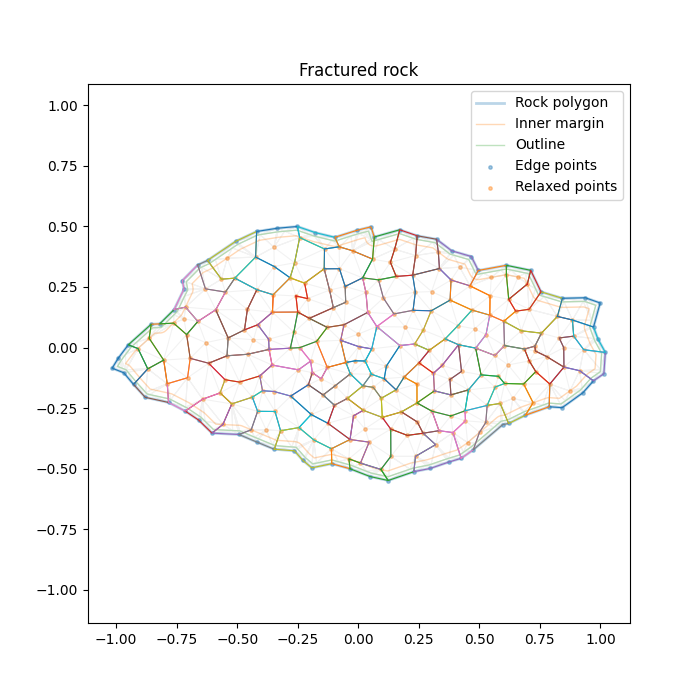

# Rock Fracture 2D

### Check out some of the generated rocks in the [Three.js](https://threejs.org/) driven demo: [https://donitzo.github.io/rock-fracture-2d](https://donitzo.github.io/rock-fracture-2d)

## Description

This rock generator was created as a better alternative for Voronoi fracturing polygons. The issue with Voronoi is that it isn't intended to be used for polygons, so you end up with sub-optimal edges. The alternative algorithm I created was to populate and relax a series of triangulation points inside any arbitrary polygon. After triangulation you randomly join the resulting triangles until you get the desired chunk size.

## Instructions

To generate your own rocks, configure the `rock_generator.py` python script by editing the constants. After running the script, you'll get a number of summary plots and a combined GLTF model.

## GLTF Model

### Standard Vertex Attributes

#### POSITION (`vec3`)

* **xy**: Vertex position in rock-local space (around center)
* **z**: Outline vertex flag if `>= 0.1`

#### NORMAL (`vec3`)

* **xy**: 2D corner normal
* **z**: Normalized angle around rock (`0-1`)

#### UV (`vec2`)

* **uv**: Centered, normalized, fixed-aspect rock extent

#### COLOR (`vec4`)

* **r**: Rock radius at vertex (scaled by `0.1`)
* **g**: Normalized depth from edge

  * `0.0` = edge
  * `1.0` = center
* **b**: Quantized triangle index

  * `x / (QUANTIZATION_SCALE - 1.0)`
* **a**: Quantized chunk index

### Custom Vertex Attributes

*(May require a custom importer)*

#### `_TRIANGLE_CENTER` (`vec3`)

* **xy**: Center of the triangle this vertex belongs to
* **z**: Vertex index in triangle (`0-2`)

#### `_CHUNK_CENTER` (`vec3`)

* **xy**: Center of the chunk this vertex belongs to
* **z**: Distance from rock center to chunk center

### Additional Metadata

Additional rock metadata is stored as JSON under the rock node’s `extras` field. This metadata includes chunk centers, graph adjacency, graph depth, chunk visibility.
