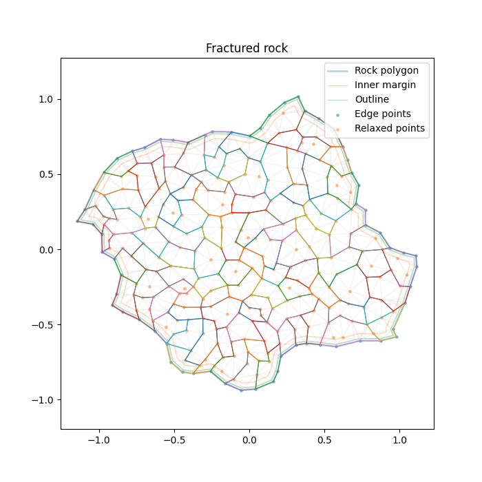
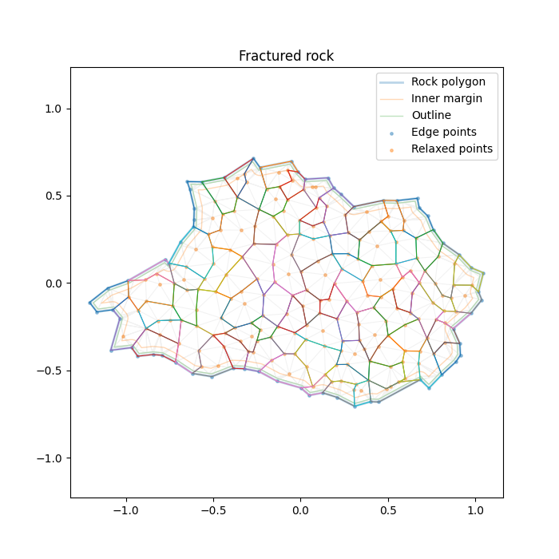
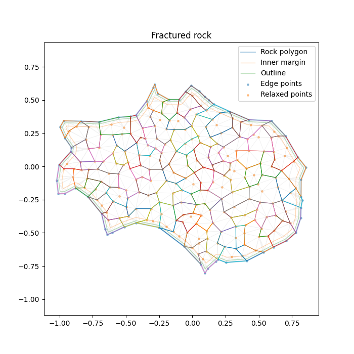
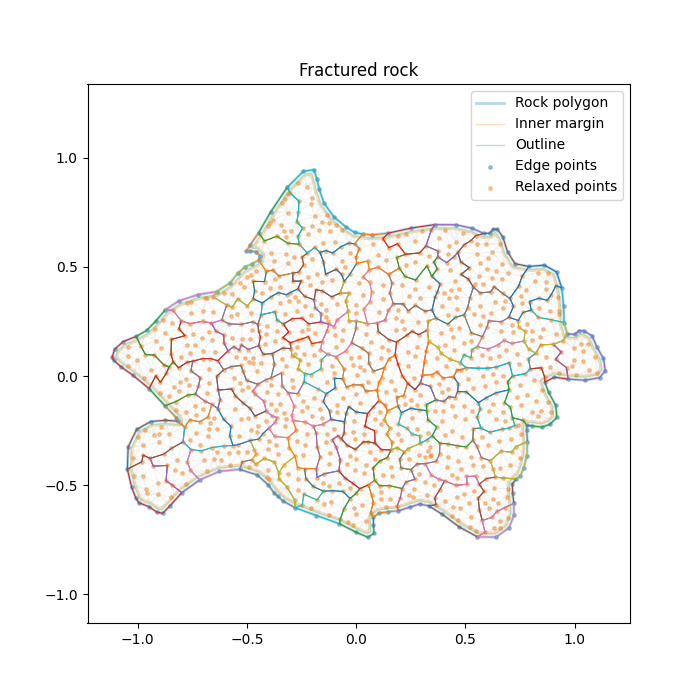
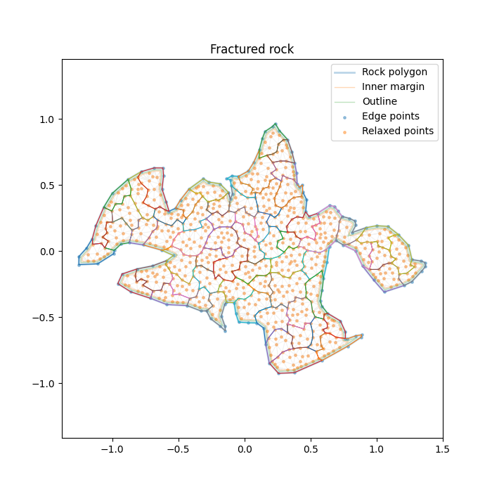

# Rock Fracture 2D

### Check out some of the generated rocks in the [Three.js](https://threejs.org/) driven demo: [https://donitzo.github.io/rock-fracture-2d](https://donitzo.github.io/rock-fracture-2d)

## Description

Generates fractured 2D rocks from arbitrary polygon outlines. Each rock is exported as a GLTF mesh containing chunk metadata suitable for shader-driven destruction effects.

This rock generator was created as a better alternative for Voronoi fracturing polygons. The issue with Voronoi is that it isn't intended to be used for polygons, so you end up with sub-optimal edges. The alternative algorithm I created was to populate and relax a series of triangulation points inside any arbitrary polygon. After triangulation you randomly join the resulting triangles until you get the desired chunk size.

The final rocks are exported as a GLTF model, with each rock represented as its own mesh. This allows rock destruction to be driven via shaders, rather than relying on a large number of small objects.

<table>
<tr>
<td></td>
<td></td>
</tr>
<tr>
<td></td>
<td></td>
</tr>
<tr>
<td></td>
<td></td>
</tr>
</table>

## Instructions

To generate your own rocks, configure the `rock_generator.py` python script by editing the constants in the top of the file. After running the script, you'll get a number of summary plots and a combined GLTF model.

## GLTF Model

A lot of different metadata are included as both `.JSON` data per rock mesh and stored in vertex buffers.

### Standard Vertex Attributes

    POSITION (vec3)

    xy: Vertex position in rock-local space (around center)
    z: Outline vertex flag if >= 0.1

    NORMAL (vec3)

    xy: 2D corner normal
    z: Normalized angle around rock (0-1)

    UV (vec2)

    uv: Centered, normalized, fixed-aspect rock extent

    COLOR (vec4)

    r: Rock radius at vertex (scaled by 0.1)
    g: Normalized depth from edge (0.0 = edge, 1.0 = center)
    b: Quantized triangle index
    a: Quantized chunk index
      x / (QUANTIZATION_SCALE - 1.0)

### Custom Vertex Attributes

(May require a custom importer)

    _TRIANGLE_CENTER (vec3)

    xy: Center of the triangle this vertex belongs to
    z: Vertex index in triangle (0-2)

    _CHUNK_CENTER (vec3)

    xy: Center of the chunk this vertex belongs to
    z: Distance from rock center to chunk center

### Additional Metadata

Additional rock metadata is stored as JSON under the rock node’s `extras` field (userData in Three.js). This metadata includes chunk centers, graph adjacency, graph depth, chunk visibility.

`chunk_visibility` divides the view around each chunk into angular segments. Each segment lists chunks that may obstruct that chunk from that direction. This can be used to choose exposed parts of a rock to attack without performing runtime geometry tests.
